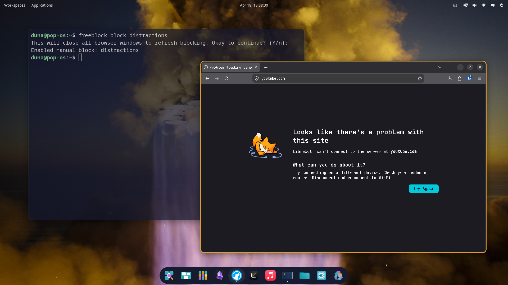

**FreeBlock is a free and open source CLI website blocker for Linux, macOS and Windows.**

## Navigation

- [About](#about)
- [Key Features](#key-features)
- [Usage](#usage)
- [Tutorial](#tutorial)
- [Getting Started](#getting-started)
- [Contributing](#contributing)
- [Roadmap](#roadmap)

## About

FreeBlock is a cross-platform website blocker that helps you focus by managing access to distracting websites. It is common knowledge at this point that multi-million dollar companies are actively fighting for our time, focus and attention; yet most people have come to accept it. For this reason, I believe it is now more important than ever to take control over how we use technology in order to focus on what actually matters to us. I built FreeBlock out of a real struggle with focus, and a lack of free tools to help me that fit my needs.

## Key Features

- **Manual blocking:** Create block lists and block them manually
- **Timed locks:** Prevent disabling lists until a timer runs out
- **Scheduled blocking:** Create schedules to enable lists automatically
- **No setup:** Supports all browsers with no setup out of the box
- **Cross-platform:** Supports Linux, macOS and Windows
- **No workarounds:** Once you block a list, there's no way to bypass it

## Usage

- `freeblock -h, --help`: Show all available commands.
- `freeblock status`: Show the current status of block lists and schedules, where green means active.
- `freeblock list add`: Create a new block list. Type one website to block per line.
- `freeblock list edit`: Edit the websites of a block list. Removing websites while the list is active is not allowed.
- `freeblock list rename`: Rename a block list.
- `freeblock list remove`: Remove a block list. Removing lists while they're active is not allowed.
- `freeblock block`: Enable manual block for a list.
- `freeblock unblock`: Disable manual block for a list.
- `freeblock lock`: Lock a list for the provided amount of time. You won't be able to disable it until the timer ends.
- `freeblock schedule add`: Create a new schedule.
- `freeblock schedule rename`: Rename a schedule.
- `freeblock schedule remove`: Remove a schedule. Removing schedules while they're active is not allowed.

## Tutorial

See [TUTORIAL.md](https://github.com/Mikuel210/FreeBlock/blob/main/TUTORIAL.md)

## Getting Started

> Note that FreeBlock is a work in progress. Expect some rough edges.

### Linux

1. Download and unzip the [latest release](https://github.com/Mikuel210/FreeBlock/releases/latest)
2. In the release directory, run `install.sh`

### macOS and Windows

Builds for macOS and Windows are coming soon! In the meantime, you can **build from source**:

1. Make sure the [.NET 10 SDK](https://dotnet.microsoft.com/en-us/download/dotnet/10.0) is installed
2. Clone the repository
3. Build the CLI and add it to your PATH
4. Build the Daemon and register it as a service running as root/administrator

## Contributing

If you spot any bugs, have any feature requests or just want to share your thoughts, feel free to open a discussion or a pull request!

## Roadmap

- [x] Timers
- [x] Editing lists
- [x] Schedules
- [x] Better onboarding
- [ ] Editing schedules
- [ ] Requesting schedule removal
- [ ] macOS and Windows builds
- [ ] Preventing known workarounds
- [ ] Blocking apps
- [ ] Self hosting (sync across devices)
- [ ] GUI Implementation
