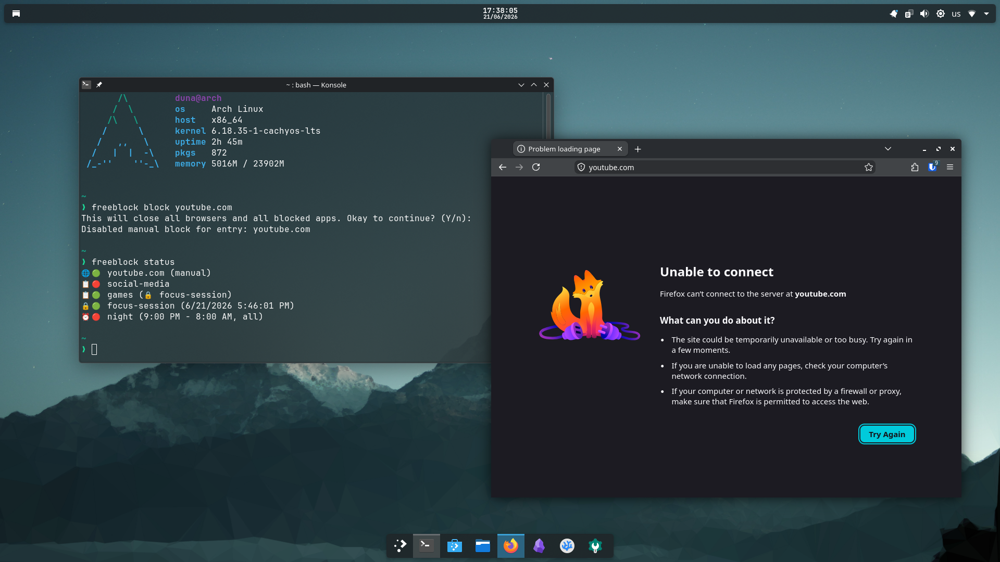

**FreeBlock is a free and open source CLI website and app blocker for Linux, macOS and Windows.**

> [!IMPORTANT]
> v1.0.0 Released featuring a unified entry system, improved locks and cross-platform builds

## Navigation

- [About](#about)
- [Key Features](#key-features)
- [Usage](#usage)
- [Getting Started](#getting-started)
- [Contributing](#contributing)
- [Roadmap](#roadmap)

## About

FreeBlock is a cross-platform blocker that helps you focus by managing access to distracting apps and websites. It is common knowledge at this point that multi-million dollar companies are actively fighting for our time, focus and attention; yet most people have come to accept it. For this reason, I believe it is now more important than ever to take control over how we use technology in order to focus on what actually matters to us. I built FreeBlock out of a real struggle with focus, and a lack of free tools to help me that fit my needs.

## Key Features

- **Manual blocking:** Block websites and apps on-demand
- **Timed locks:** Block websites and apps until a timer runs out
- **Scheduled blocking:** Create schedules to block entries automatically
- **No setup:** Supports all browsers and apps with no setup out of the box
- **Cross-platform:** Supports Linux, macOS and Windows
- **No workarounds:** Once you block something, there's no way to bypass it

## Usage

**Usage:** freeblock [-v | --version] [-h | --help] [--uninstall] \<command> [\<args>]

**Manage blocking:**
- `freeblock status`: Show the current status of blocking, where green means active.
- `freeblock block`: Enable manual block for one or more entries.
- `freeblock unblock`: Disable manual block for one or more entries.

**Manage block lists:**
- `freeblock list add`: Create a new block list from a set of entries.
- `freeblock list edit`: Edit the entries of a block list.
- `freeblock list rename`: Rename a block list.
- `freeblock list remove`: Remove a block list.

**Manage locks:**
- `freeblock lock add`: Block one or more entries for the provided amount of time.
- `freeblock lock edit`: Add entries to a lock.
- `freeblock lock rename`: Rename a lock.

**Manage schedules:**
- `freeblock schedule add`: Create a new schedule to enable entries automatically.
- `freeblock schedule edit`: Edit the properties of a schedule.
- `freeblock schedule rename`: Rename a schedule.
- `freeblock schedule remove`: Remove a schedule.

See [TUTORIAL.md](https://github.com/Mikuel210/FreeBlock/blob/main/TUTORIAL.md) for a full guide on how to use FreeBlock.

## Getting Started

### Linux and macOS

1. Download and unzip the [latest release](https://github.com/Mikuel210/FreeBlock/releases/latest) for your platform
2. In the release directory, run `install.sh`

> [!NOTE]
> The installer for Linux only works with `systemd` as of now. If you use a different init system, you might need to register the daemon service manually.

### Windows

1. Open PowerShell as administrator
2. Run `Set-ExecutionPolicy -ExecutionPolicy Bypass -Scope Process` to allow for unsigned scripts to run
3. In the release directory, run `install.ps1`

## Contributing

If you spot any bugs, have any feature requests or just want to share your thoughts, feel free to open an issue or a discussion!

## Roadmap

- [x] Timers
- [x] Editing lists
- [x] Schedules
- [x] Better onboarding
- [x] Blocking apps
- [x] Editing schedules
- [x] Requesting schedule removal
- [x] Unified entry system
- [x] macOS and Windows builds
- [ ] Break feature
- [ ] More configuration options
- [ ] Self hosting
- [ ] Android client
- [ ] Graphical dashboard

---

Made with ❤️ for [Horizons](http://horizons.hackclub.com) thanks to [Hack Club](https://hackclub.com)

> No AI was used in this project for any documentation or code except for install and migration scripts
