## Navigation

- [Introduction](#introduction)
- [Key Concepts](#key-concepts)
- [Basic Usage](#basic-usage)
- [Creating a Block List](#creating-a-block-list)
- [Blocking Lists](#blocking-lists)
- [Unblocking Lists](#unblocking-lists)
- [Removing Lists](#removing-lists)
- [Timed Locks](#timed-locks)
- [Creating Schedules](#creating-schedules)
- [Removing Schedules](#removing-schedules)
- [Summary](#summary)

## Introduction

It is common knowledge at this point that multi-million dollar companies are actively fighting for our time, focus and attention; yet most people have come to accept it. For this reason, I believe it is now more important than ever to take control over how we use technology in order to focus on what actually matters to us. 

FreeBlock allows you to restrict access to distracting websites to focus on the things that matter to you. In this tutorial, you will learn how to use and make the most of FreeBlock in order to regain control over your digital life.

## Key Concepts

- A **block list** is a collection of websites you can block
- When a list is **enabled**, all of its websites are blocked
- **Manual block** allows you to enable or disable a list on-demand
- **Timed locks** enable a list until a timer runs out
- **Schedules** enable lists automatically in certain time periods
- A list will be enabled if it's either locked, scheduled, or blocked manually

## Basic Usage

`freeblock [command] [arguments]`

- `freeblock -h, --help` shows all the available commands
- `freeblock status` shows the current status of block lists and schedules, where green means enabled

> Note: If an argument required by the command is not provided, you will be prompted to provide it afterwards. This means you can either provide arguments through the command line or afterwards through `stdin`.

## Creating a Block List

Let's start by creating a list of distracting websites to block. To do that, we will use the `freeblock list add [name]` command.

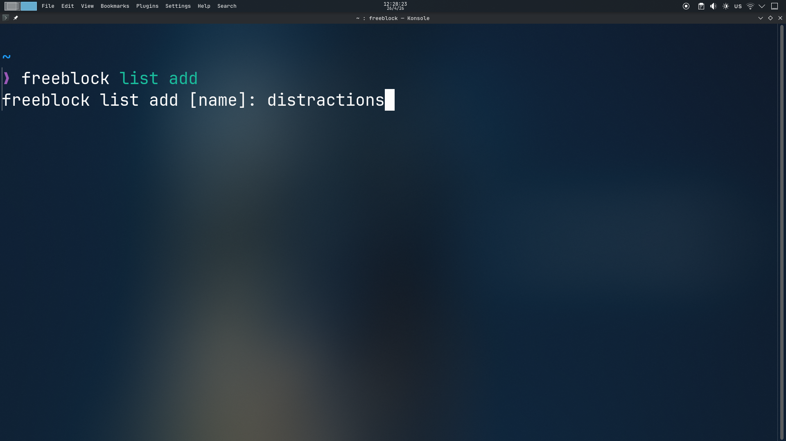

I've chosen to name my list "distractions". After running the command, a file will open in your preferred text editor. Type one website per line in order to add it to the block list.

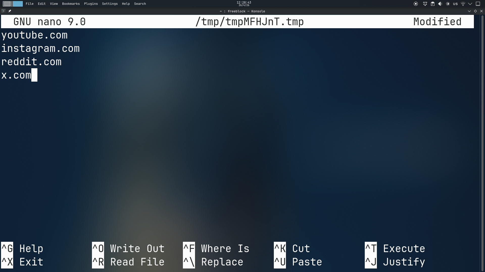

> Note: Websites shouldn't start with `https://` or `www.`, as shown in the picture

After you save and close the file, the list will be created. Now, if you run `freeblock status`, the list you just created should be shown.

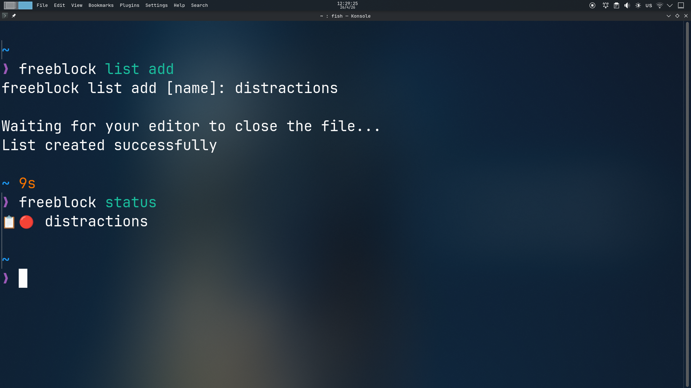

## Blocking Lists

Now that we've created our first list, let's try blocking it. To do that, we will use the `freeblock block [list]` command. After you run the command, you will be warned that all browser windows will close. This is required in order to make sure blocking takes immediate effect.

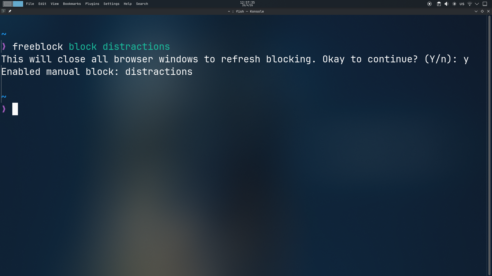

If you now open a browser and try to go into a blocked website, it will refuse the connection.

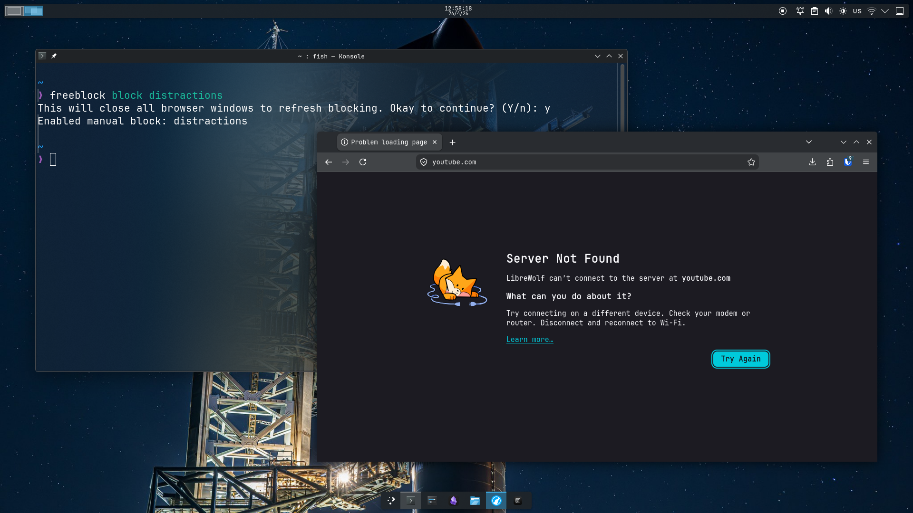

If you now run `freeblock status`, the list will appear as enabled. It will also show you the reason it's enabled - in this case it's because it was blocked manually.

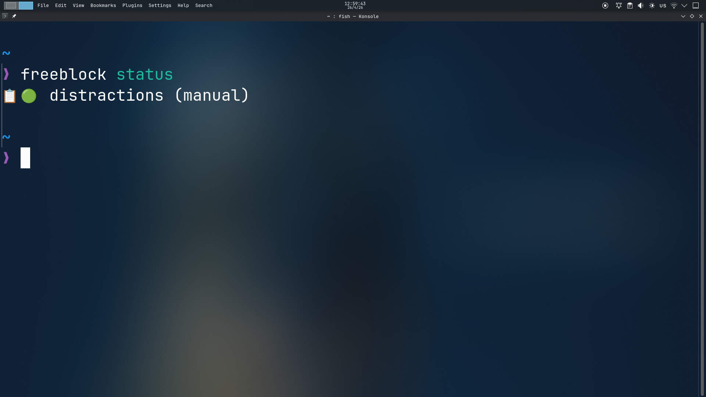

## Unblocking Lists

To unblock the list, use `freeblock unblock [list]`. This command doesn't require for all browsers to be closed, and you should be able to visit the previously blocked websites immediately.

> Note that `freeblock unblock` may not necessarily disable a list as it might remain enabled by timed locks or schedules

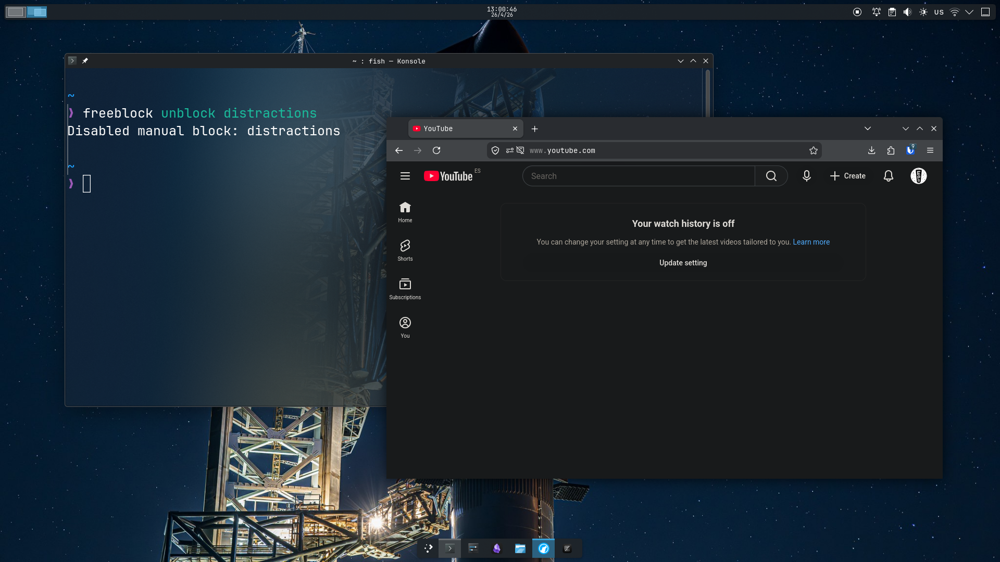

If you now run `freeblock status`, the list will appear as disabled.

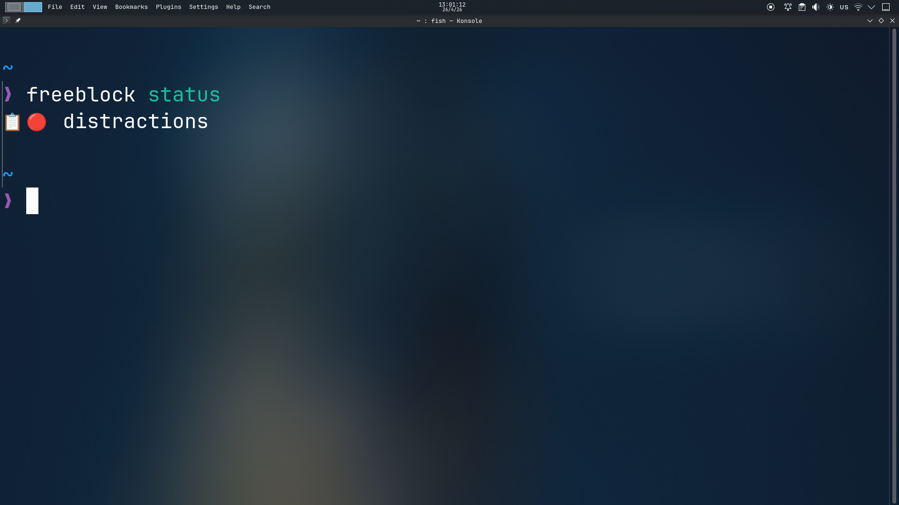

## Editing Lists

To edit a list, use `freeblock list edit [list]`. This will open the list file for you to add or remove websites.

> Note that removing websites while a list is active is not allowed

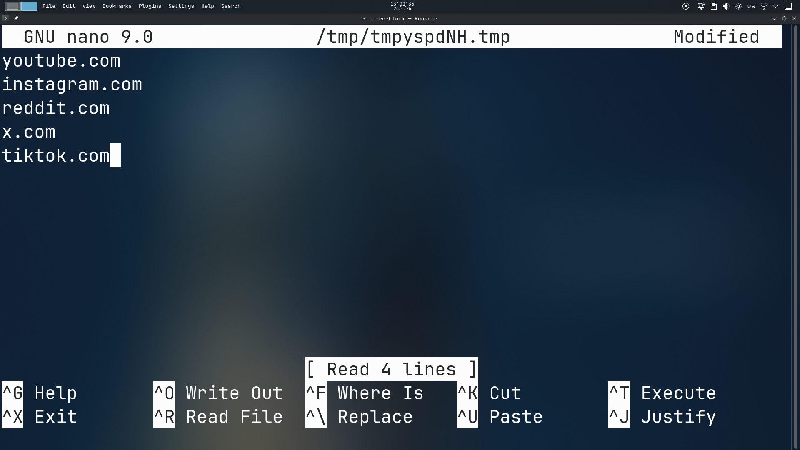

To rename a list, use `freeblock list rename [old] [new]`.

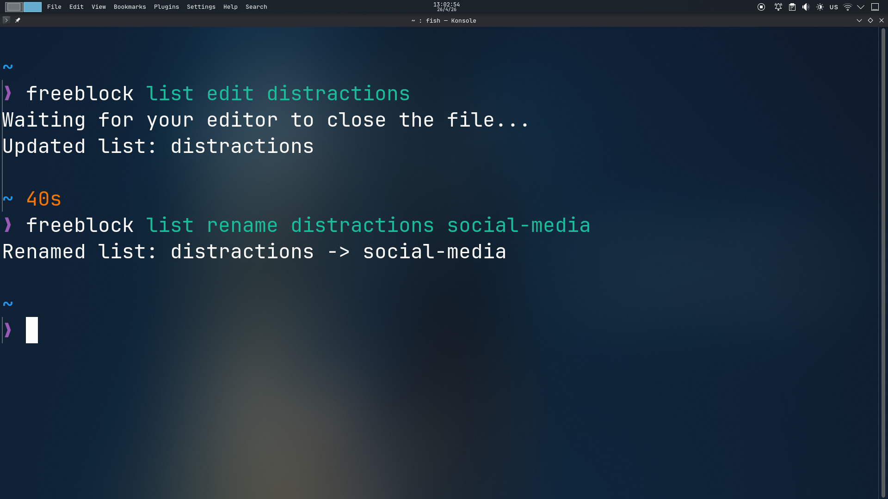

## Removing Lists

To remove a list, use `freeblock list remove [list]`. Note that the list can't be enabled nor used by a schedule in order to be removed.

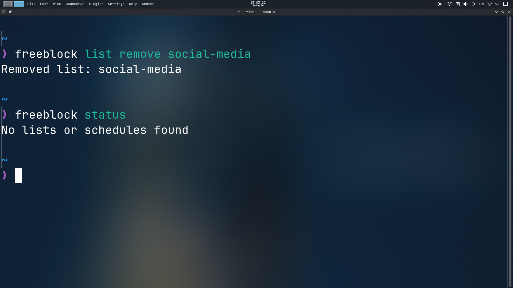

## Timed Locks

Timed locks allow you to enable a list for a provided amount of time. This is especially useful for starting a focus session - you won't be able to disable the list until the timer runs out.

Let's try locking the list we created previously by running `freeblock lock [list] [time]`. I will block it for one minute.

> Make sure to provide the time in the following format: HH:MM or HH:MM:SS

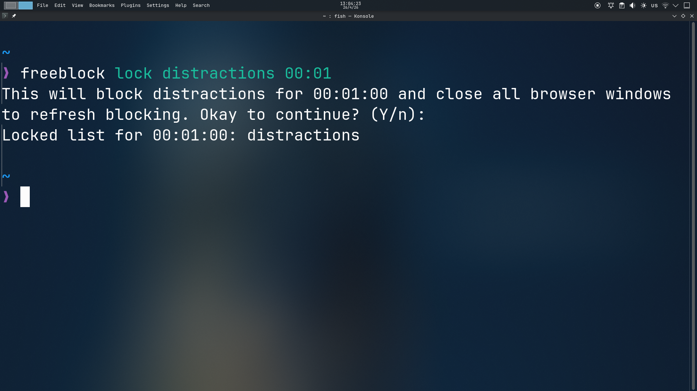

> Note: This command also requires for all browsers to close in the case the list wasn't already active.

If you now run `freeblock status`, the list will appear as enabled and locked until a minute from now.

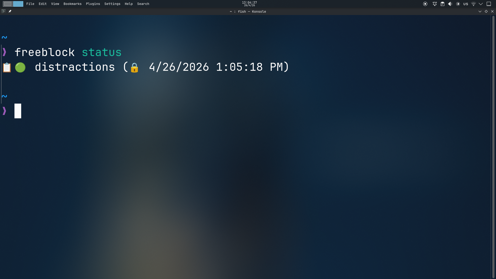

## Creating Schedules

Schedules enable lists automatically in certain time periods. Let's try creating one in order to block distracting websites at night. To do that, we will use the `freeblock schedule add [name] [lists] [start] [end] [days]` command.

### Arguments

- `name`: The name of the schedule
- `lists`: The lists to block when the schedule is active (comma separated)
- `start`: The start time for the schedule (HH:MM or HH:MM:SS)
- `end`: The end time for the schedule (HH:MM or HH:MM:SS)
- `days`: The days of the week the schedule is active (weekdays, weekends, all, or custom combinations of MTWHSU - e.g. MWS, HSU, MTWH...)

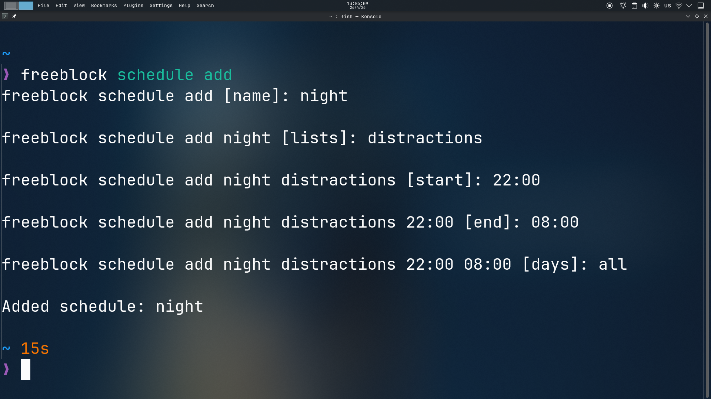

I've created a schedule called "night" that blocks the list "distractions" from 10pm to 8am everyday. Note that when a schedule starts, all browsers will close. You will be warned a minute before the schedule starts so you can save your work.

> Note that warnings are only implemented for Linux as of now

Fast-forward to 9:59pm and I've received a notification warning me that the schedule is starting soon and all browsers will close in a minute.

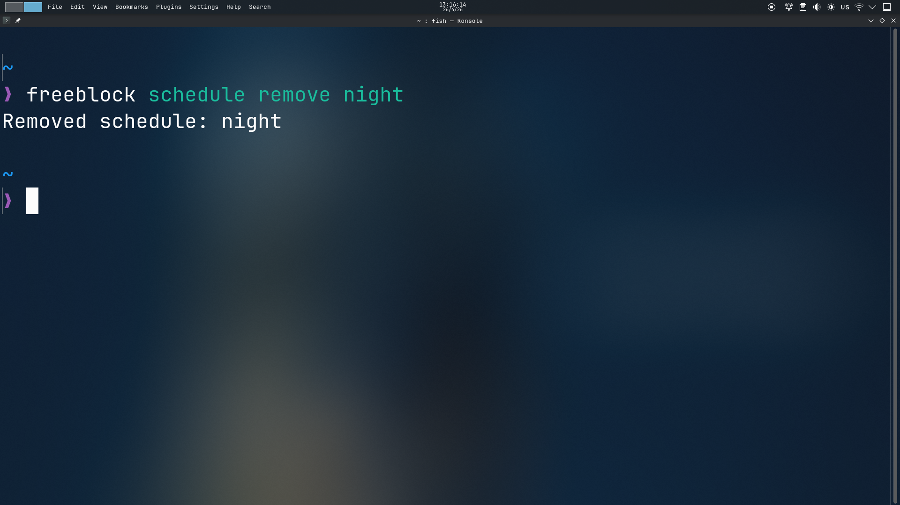

After the minute has passed, if I now run `freeblock status`, I will see the schedule is enabled and the list is enabled as well due to the schedule being active.

## Removing Schedules

To remove a schedule, use `freeblock schedule remove [name]`. Note that you can't remove a schedule if it's active.

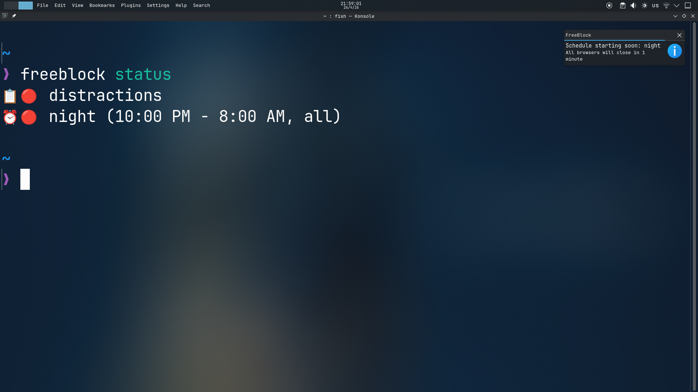

## Summary

- `freeblock -h, --help`: Show all available commands.
- `freeblock status`: Show the current status of block lists and schedules, where green means active.
- `freeblock list add`: Create a new block list. Type one website to block per line.
- `freeblock list edit`: Edit the websites of a block list. Removing websites while the list is active is not allowed.
- `freeblock list rename`: Rename a block list.
- `freeblock list remove`: Remove a block list. Removing lists while they're active is not allowed.
- `freeblock block`: Enable manual block for a list.
- `freeblock unblock`: Disable manual block for a list.
- `freeblock lock`: Lock a list for the provided amount of time. You won't be able to disable it until the timer ends.
- `freeblock schedule add`: Create a new schedule.
- `freeblock schedule rename`: Rename a schedule.
- `freeblock schedule remove`: Remove a schedule. Removing schedules while they're active is not allowed.
