> Last update: v0.6.0

## Navigation

- [Introduction](#introduction)
- [Key Concepts](#key-concepts)
- [Basic Usage](#basic-usage)
- [Manual Blocking](#manual-blocking)
    - [Blocking a Website](#blocking-a-website)
    - [Blocking an App](#blocking-an-app)
    - [Unblocking Entries](#unblocking-entries)
- [Block Lists](#block-lists)
    - [Creating a Block List](#creating-a-block-list)
    - [Composing Block Lists](#composing-block-lists)
    - [Editing Block Lists](#editing-block-lists)
    - [Removing Block Lists](#removing-block-lists)
- [Timed Locks](#timed-locks)
    - [Creating a Lock](#creating-a-lock)
    - [Editing a Lock](#editing-a-lock)
- [Schedules](#schedules)
    - [Creating a Schedule](#creating-a-schedule)
    - [Editing Schedules](#editing-schedules)
    - [Removing Schedules](#removing-schedules)
- [Summary](#summary)

## Introduction

It is common knowledge at this point that multi-million dollar companies are actively fighting for our time, focus and attention; yet most people have come to accept it. For this reason, I believe it is now more important than ever to take control over how we use technology in order to focus on what actually matters to us. 

FreeBlock allows you to restrict access to distracting apps and websites to focus on the things that matter to you. In this tutorial, you will learn how to use and make the most of FreeBlock in order to regain control over your digital life.

## Key Concepts

- **Entries** are websites, apps or block lists
- **Manual block** allows you to block entries on-demand
- **Timed locks** block entries until a timer runs out
- **Schedules** block entries automatically in certain time periods
- **Block lists** are collections that group multiple entries

## Basic Usage

Usage: freeblock \<command> [\<args>]

- `freeblock [-v, --version]`: Show the installed FreeBlock version
- `freeblock [-h, --help]`: Show all the available commands
- `freeblock [--uninstall]`: Uninstall FreeBlock if no blocking is taking place
- `freeblock status`: Show the current status of manual blocking, locks and schedules

> [!NOTE]
> For every command, if a required argument is not provided, you will be prompted to provide it afterwards. This means you can either provide arguments through the command line or afterwards interactively.

## Manual Blocking

Manual blocking allows you to block or unblock entries on-demand.

### Blocking a Website

Let's start by blocking our first website. To do this, we will use the `freeblock block [entries]` command.

This command takes a set of entries, that is, a set of websites, apps or block lists.

For now, let's run `freeblock block youtube.com` to block YouTube.

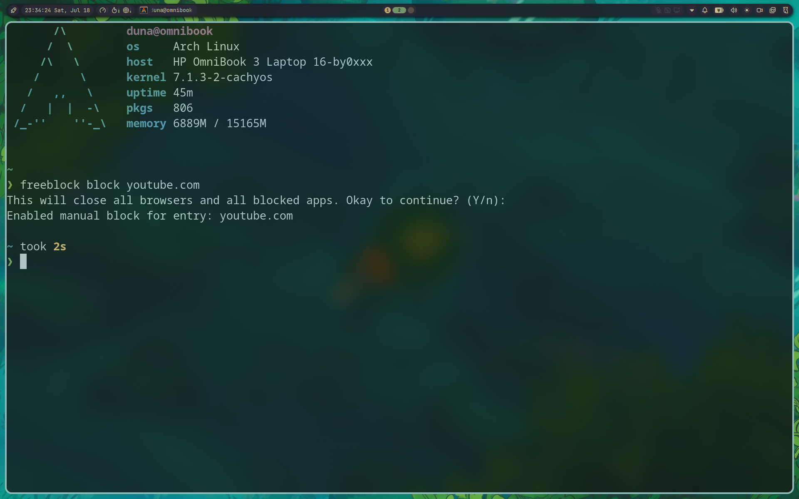

You will be warned that all browsers will close. This is required for blocking to take immediate effect.

Now, if you go to `youtube.com`, the connection will refuse.

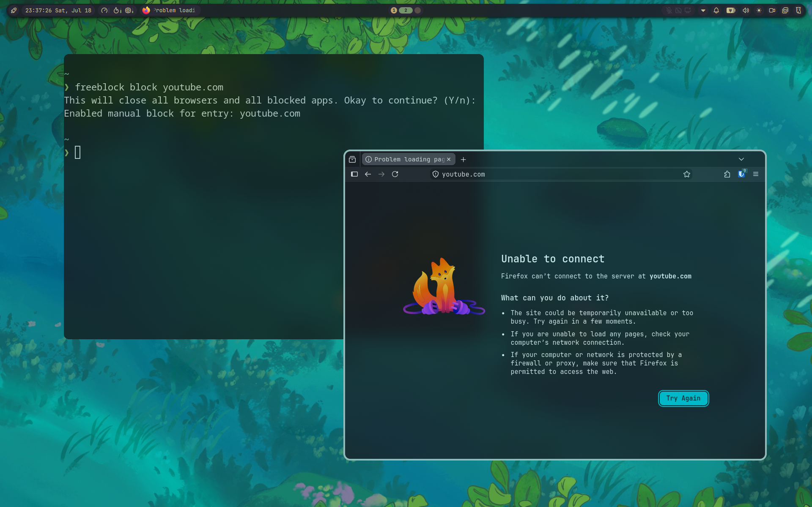

If we now run `freeblock status`, the website we just blocked will appear.

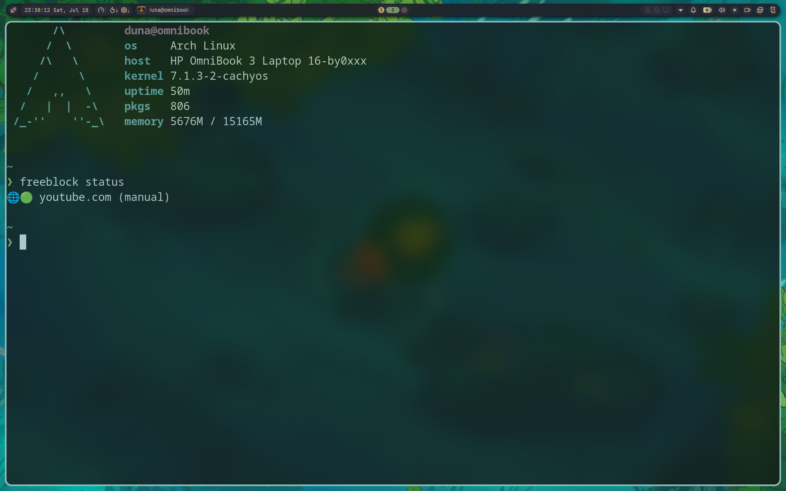

Green (🟢) means the entry is active and the web (🌐) emoji means the entry is a website.

It also shows the reason it's active: in this case is because we've blocked it manually.

### Blocking an App

Blocking apps works very similarly to blocking websites. To do it, you will need the process name of the app you want to block.

App entries use the prefix `+`. I will block Slack by using `freeblock block +slack`.

In this case, all instances of Slack will close on running the command, and I won't be able to open more until it is unblocked.

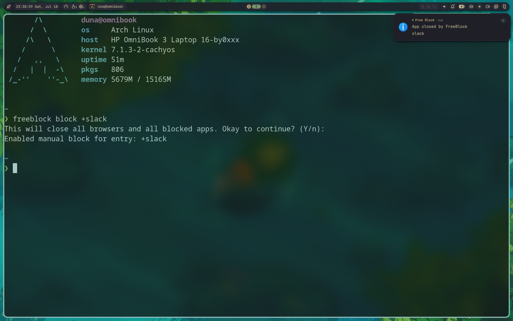

If we now run `freeblock status`, the app we just blocked will appear.

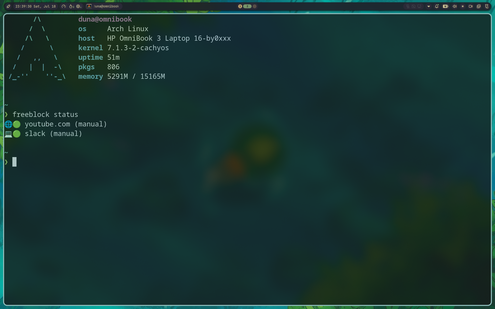

Green (🟢) means the entry is active and the laptop (💻) emoji means the entry is an app.

### Unblocking Entries

Let's unblock the two entries we had previously blocked. To do this, we will use `freeblock unblock [entries]`.

As in `freeblock block`, this command takes a set of entries to be unblocked. I'll run `freeblock unblock youtube.com +slack` in order to unblock both at once.

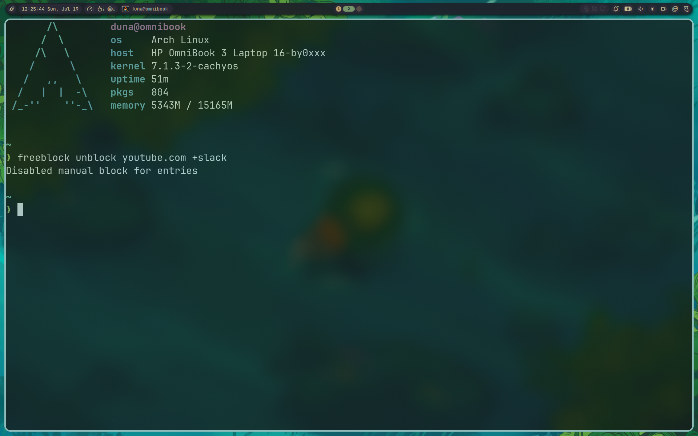

Now, I can visit YouTube and open Slack as usual.

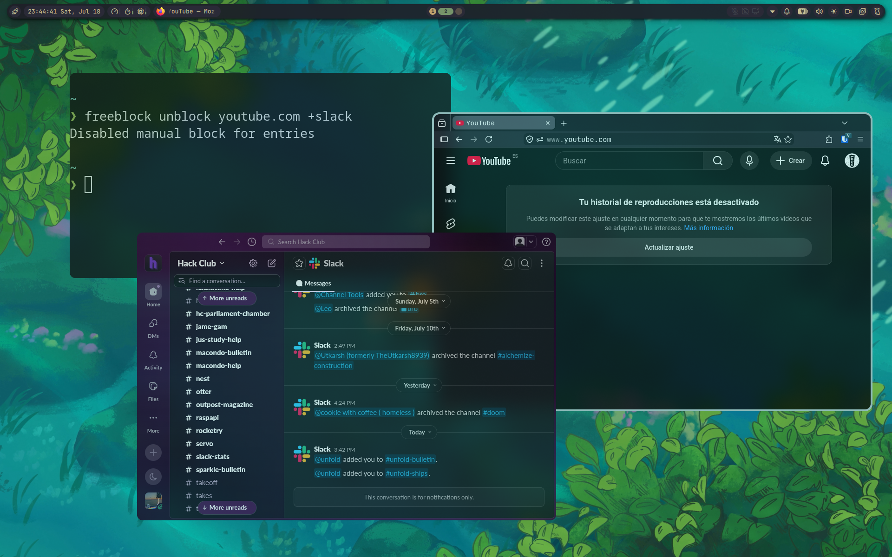

## Block Lists

A block list is a collection that groups websites and apps together and allows you to use them as a single entry.

### Creating a Block List

I'm going to create a list called `social-media`. To do this, I'll use the `freeblock list add [name]` command.

A file will open in your preferred text editor. Type one entry per line in order to add it to the block list.

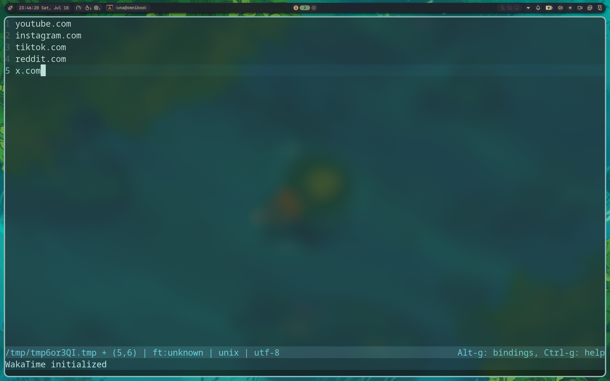

> [!TIP]
> You can add comments by starting a line with `#`

If you now run `freeblock status`, the list we just created will appear.

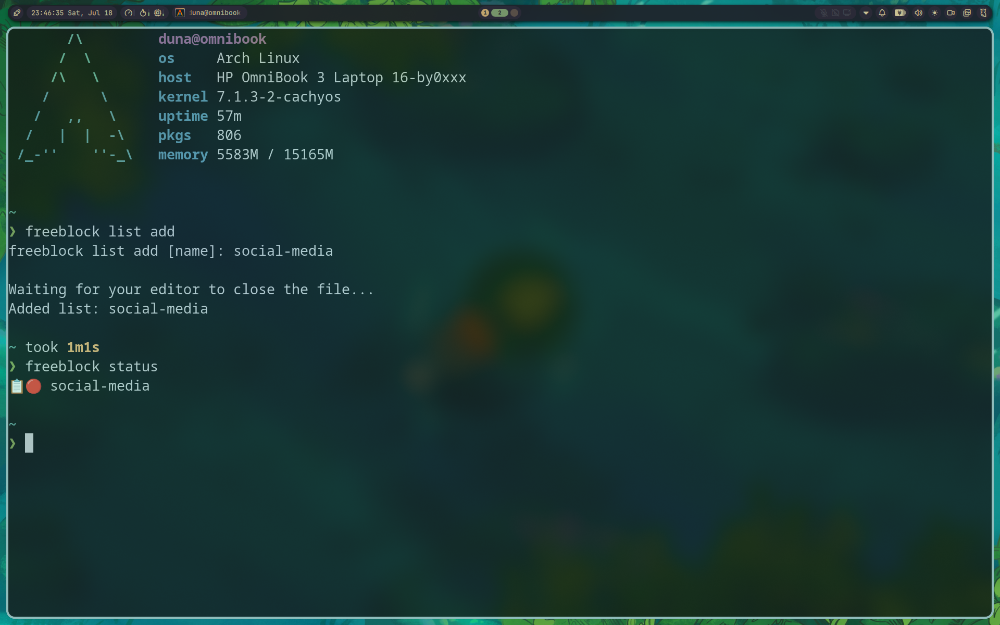

Red (🔴) means it's not active and the clipboard (📋) emoji indicates it's a list.

Let's try blocking the list manually. To do that, I will run `freeblock block @social-media`. The prefix for list entries is `@`.

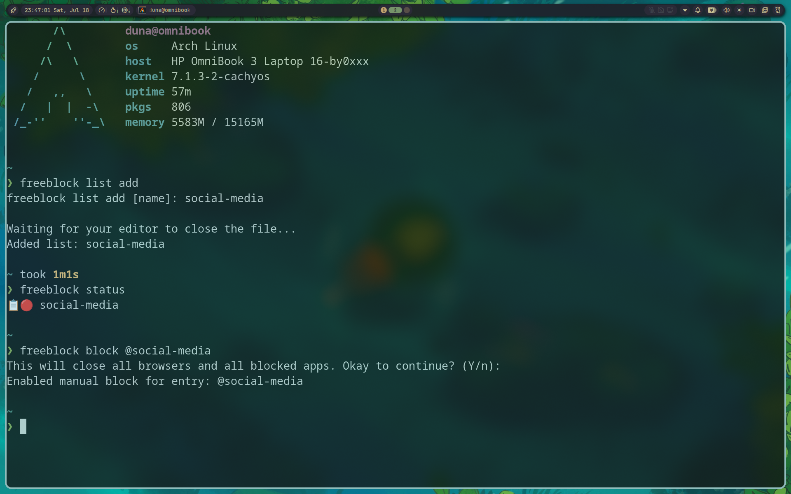

In this case, all entries I've included are websites, but apps would use the `+` prefix here too as you'd expect. Manual block, locks, lists and schedules all use the same entry system: no prefix for websites, `+` for apps and `@` for lists.

Now, if I go to any of the websites I included in the list, the connection will refuse. All websites in the list have been blocked at once.

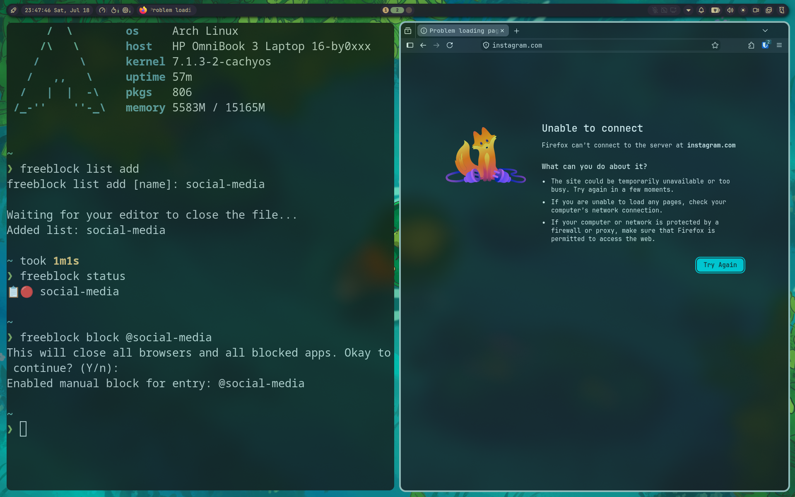

If you now run `freeblock status`, the list will appear as active.

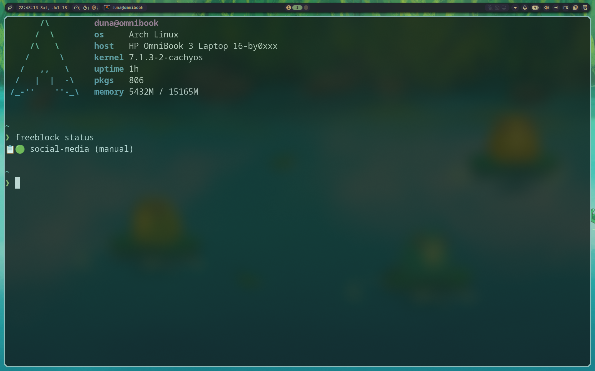

### Composing Block Lists

Block lists accept any kind of entry. This means you can reference other lists inside of lists.

For the demonstration, I'm going to first create a list called `games`, in which I will include Steam and all of the games I have installed.

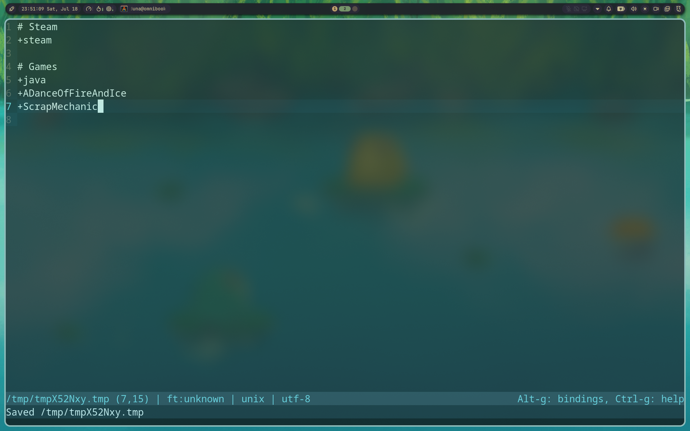

After that, I'm going to create a list called `distractions`. In it, I will include the `social-media` and `games` lists as well as Slack.

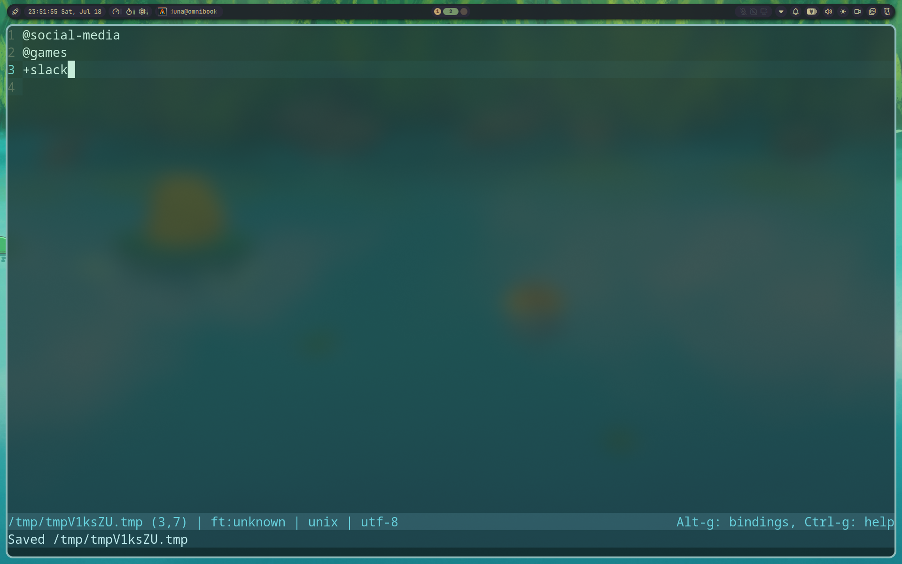

If I now run `freeblock block @distractions` and then check `freeblock status`, the `social-media` and `games` lists appear as active as they're blocked by the `distractions` list.

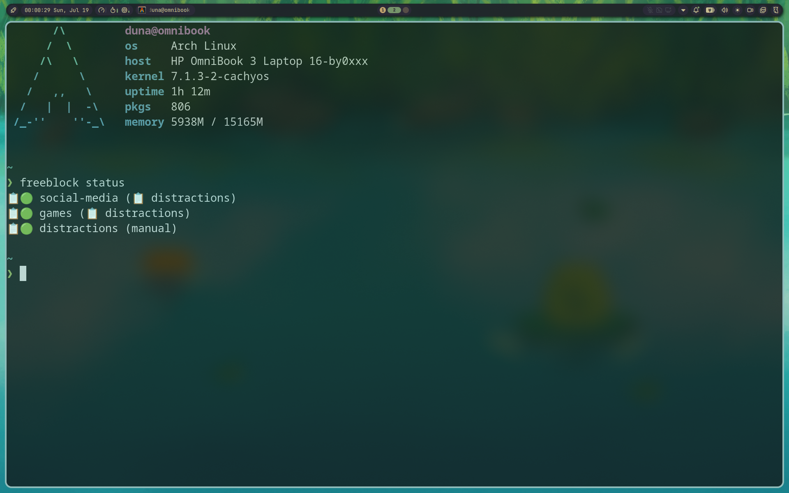

### Editing Block Lists

To edit the entries of a list, use `freeblock list edit [name]`.

To rename a list, use `freeblock list rename [old], [new]`.

> [!NOTE]
> Removing entries from a list while it's active is not allowed

### Removing Block Lists

To remove a list, use `freeblock list remove [name]`.

> [!NOTE]
> Removing lists while they're active is not allowed. Removing lists referenced by other lists, locks or schedules is not allowed either.

## Timed Locks

Timed locks allow you to block a set of entries until a timer runs out. This is specially useful for focus sessions, as you won't be able to unblock the entries until the timer runs out.

### Creating a Lock

I'm going to create a lock to help me focus for 30 minutes. To do that, I'll use the `freeblock lock add [name] [time] [entries]` command. I'll name the lock `focus-session` and I'll block the list `distractions` for 30 minutes by running `freeblock lock add focus-session 00:30 @distractions`.

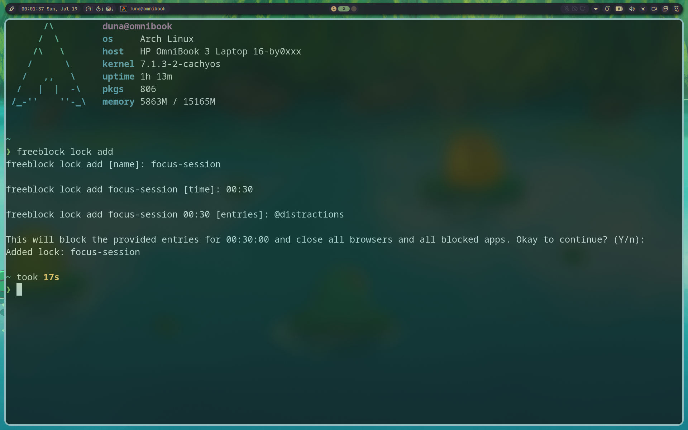

> [!NOTE]
> `[time]` is the duration of the lock in the following format: HH:MM(:SS)

If I now run `freeblock status`, the lock we just created will appear. It shows the time it will end, and the list `distractions` will appear as active because of the lock.

### Editing a Lock

You can add entries to a lock by using `freeblock lock edit [name] [entries]`. Removing locks or removing entries from locks is not allowed.

To rename a lock, use `freeblock lock rename [old] [new]`.

> [!NOTE]
> Extending the duration of a lock is not supported as of now.

## Schedules

Schedules allow you to enable entries automatically in certain time periods. 

### Creating a Schedule

I'm going to create a schedule in order to block distractions at night. To do that, I'll use the `freeblock schedule add [name] [start] [end] [days] [entries]` command.

#### Arguments

- `name`: The name of the schedule
- `start`: The start time for the schedule (HH:MM(:SS))
- `end`: The end time for the schedule (HH:MM(:SS))
- `days`: The days of the week the schedule is active (weekdays, weekends, everyday, or custom combinations of MTWHSU, e.g. MWS, HSU, MTWH...)
- `entries`: The set of entries to block

> [!NOTE]
> When a schedule starts, all browsers and all blocked apps will close. You will be warned a minute before the schedule starts so you can save your work. Note that notifications are not implemented on Windows as of now.

I'll run `freeblock schedule add night 21:00 08:00 everyday @distractions` to create the schedule.

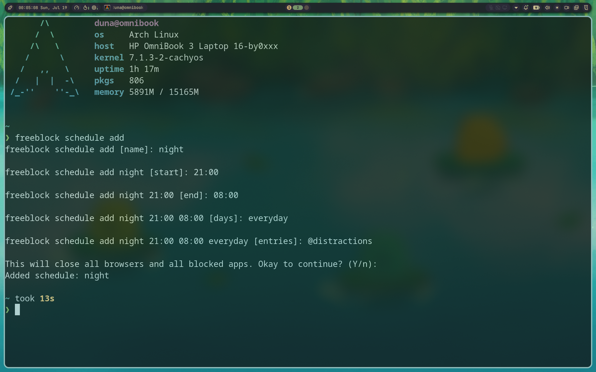

If I now run `freeblock status`, I'll see the schedule I just created.

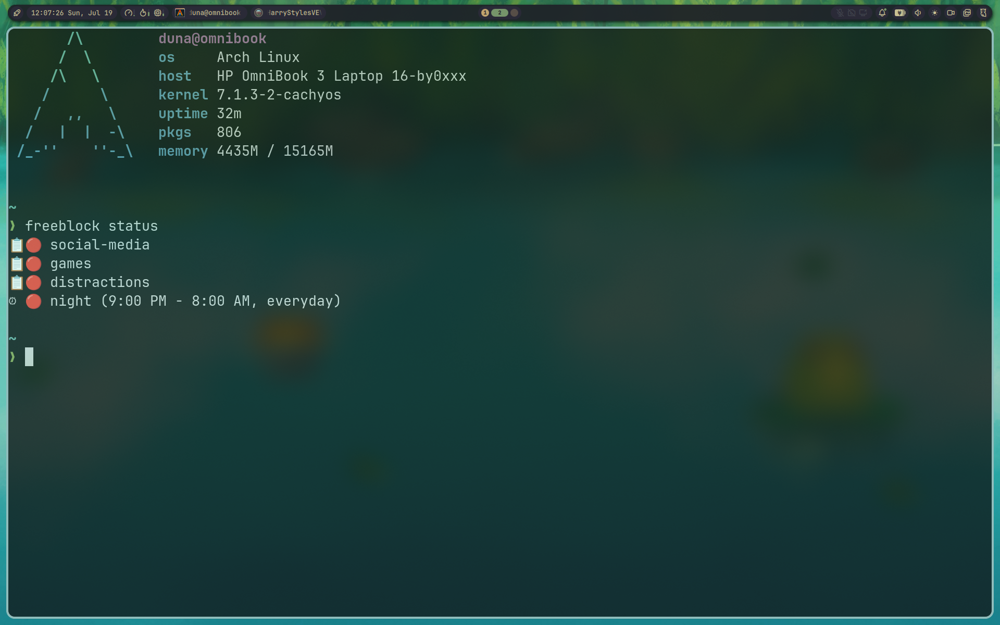

Fast-forward to 8:59pm and I've received a notification warning me that the schedule is starting soon and all browsers and blocked apps will close in a minute.

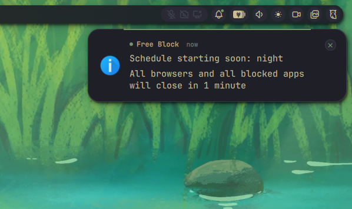

After the minute has passed, if I now run `freeblock status`, I will see the schedule is enabled and the list is enabled as well due to the schedule being active.

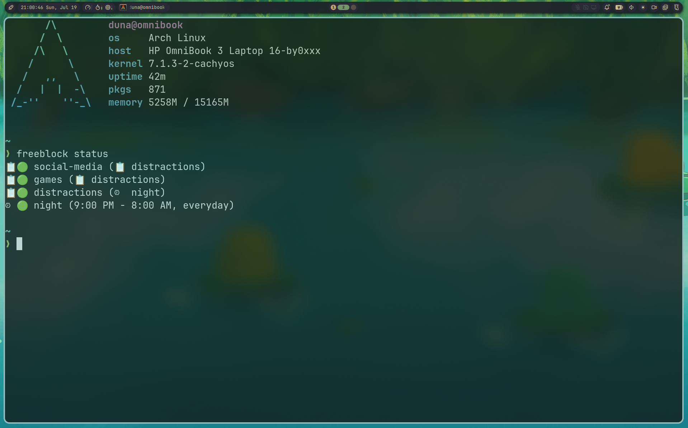

### Editing Schedules

To edit a schedule, use `freeblock schedule edit [name] [start] [end] [days] [entries]`.

To rename a schedule, use `freeblock schedule rename [old] [new]`.

> [!NOTE]
> Making a schedule less strict while it's active is not allowed.

### Removing Schedules

To remove a schedule, use `freeblock schedule remove [name]`. Note that you can't remove a schedule if it's active.

## Summary

**Usage:** freeblock [-v | --version] [-h | --help] [--uninstall] \<command> [\<args>]

**Manage blocking:**
- `freeblock status`: Show the current status of blocking, where green means active.
- `freeblock block`: Enable manual block for one or more entries.
- `freeblock unblock`: Disable manual block for one or more entries.

**Manage block lists:**
- `freeblock list add`: Create a new block list from a set of entries.
- `freeblock list edit`: Edit the entries of a block list.
- `freeblock list rename`: Rename a block list.
- `freeblock list remove`: Remove a block list.

**Manage locks:**
- `freeblock lock add`: Block one or more entries for the provided amount of time.
- `freeblock lock edit`: Add entries to a lock.
- `freeblock lock rename`: Rename a lock.

**Manage schedules:**
- `freeblock schedule add`: Create a new schedule to enable entries automatically.
- `freeblock schedule edit`: Edit the properties of a schedule.
- `freeblock schedule rename`: Rename a schedule.
- `freeblock schedule remove`: Remove a schedule.
